# Cache-sim

Cache-sim is a project about collecting and visualizing data about different cache configurations with 4 mandatory experiments and a bonus one in the "Computer Organization and Architecture II" course at Federal University of Pelotas utilizing the [SimpleScalar](https://github.com/toddmaustin/simplesim-3.0) along with self-made scripts to generate the data and turn it into CSV files and [Matplotlib](https://matplotlib.org/) python library to make graphs.

The benchmarks used in this experiment were [GCC](https://www.spec.org/cpu2000/CINT2000/176.gcc/docs/176.gcc.html) and [GO](https://www.spec.org/cpu95/CINT95/099.go/).

## Tutorial

```bash
 $ git clone https://github.com/ganassini/cache-sim
 $ cd cache-sim
 $ git clone https://github.com/toddmaustin/simplesim-3.0
 $ cd simplesim-3.0
 $ make config-pisa
 $ make
 $ cd ../experiment-[1|2|3|4|bonus]
 $ nano run.sh # modify $DIR variable to match the path
 $ ./generate_data.py
 $ ./plot_[gcc|go].py
```

## Experiment 1
The first experiment made serves the purpose of showing the difference between unified and split caches (instruction L1 cache and data L1 cache) by comparing the number of misses of each cache implementation with different cache sizes.

### GCC
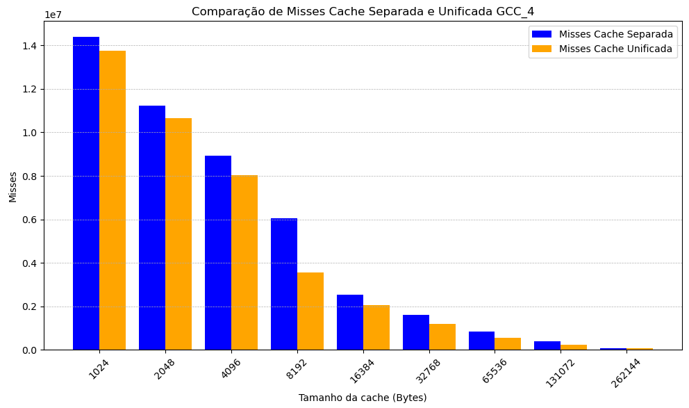
### GO
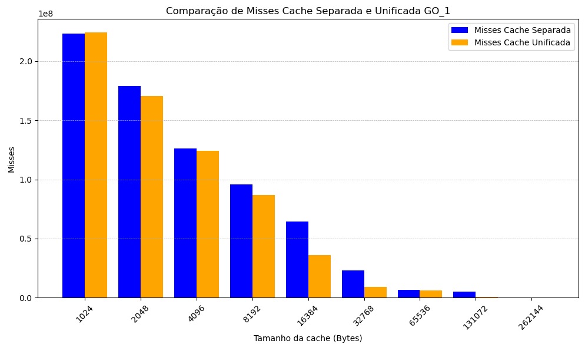

## Experiment 2
The second experiment shows the difference between different cache mappings, Direct Mapping, 8-way Associative, 16-way Associative and Fully Associative by the miss ratio of the cache.

### GCC
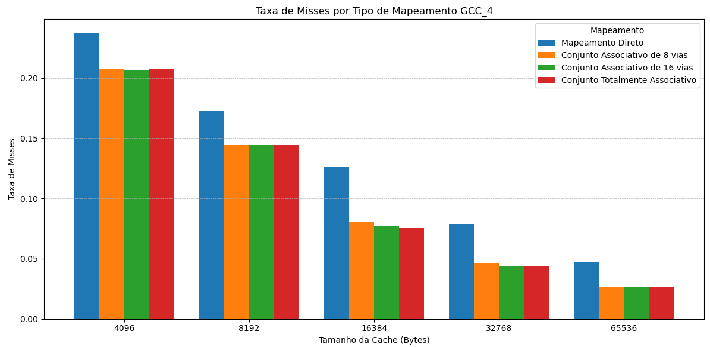
### GO
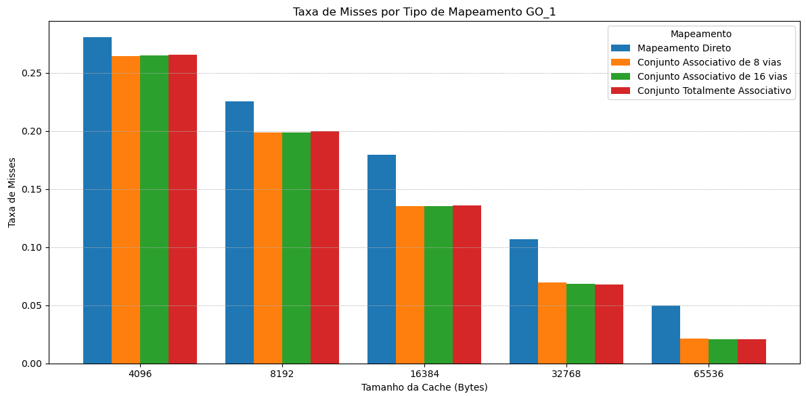


## Experiment 3
The third experiment shows how different replacement policies impact on the cache performance by the miss ratio of the cache.
### GCC
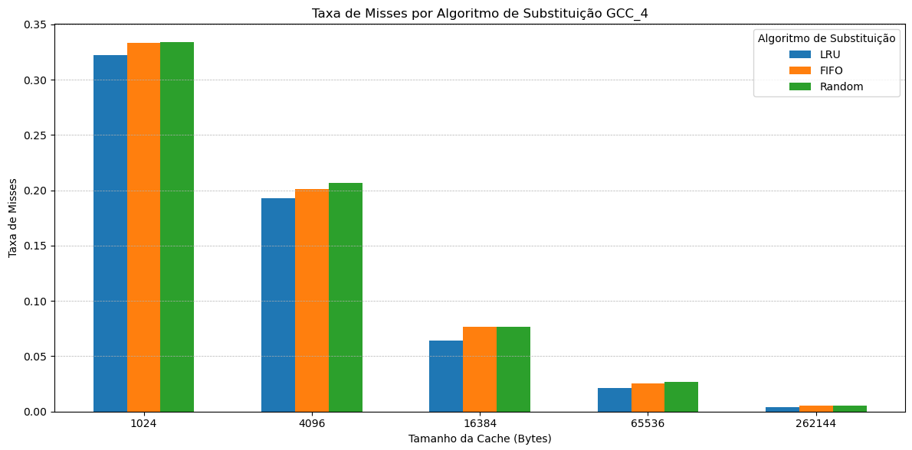
### GO
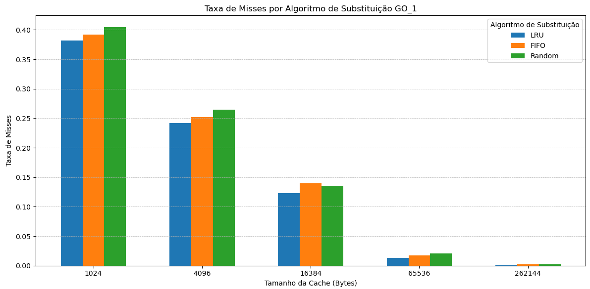

## Experiment 4
The fourth experiment show how the block size impact on the cache performance

### GCC
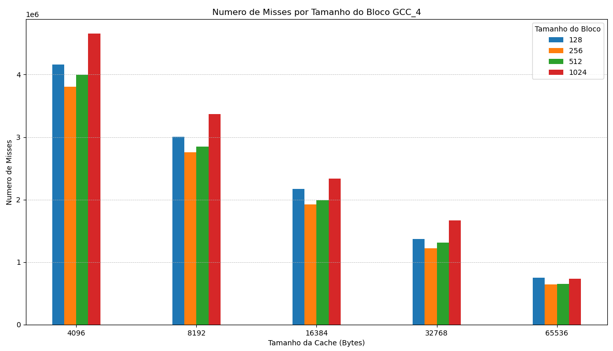
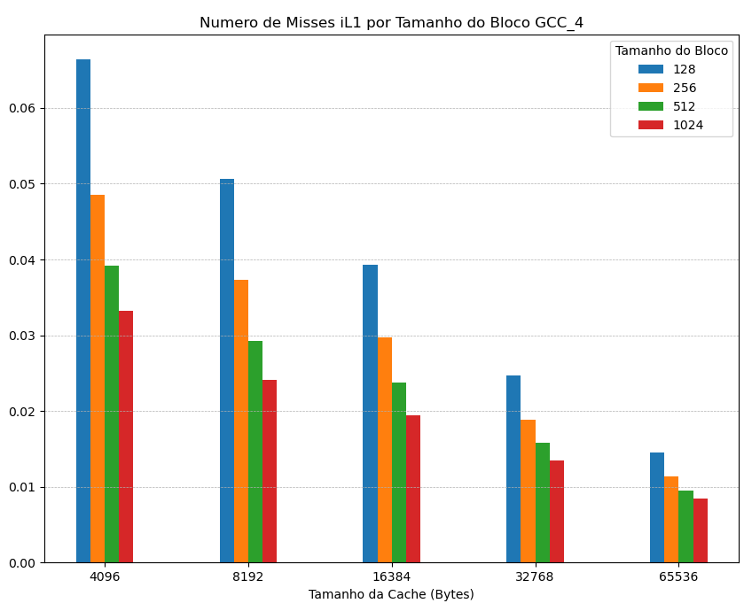
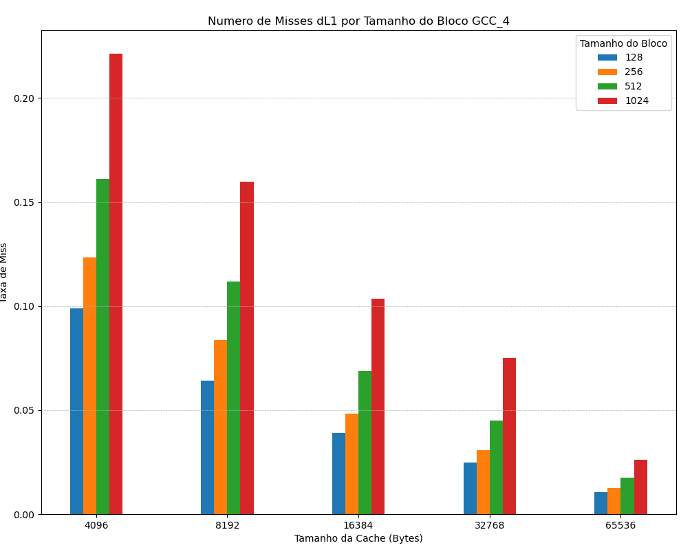
### GO
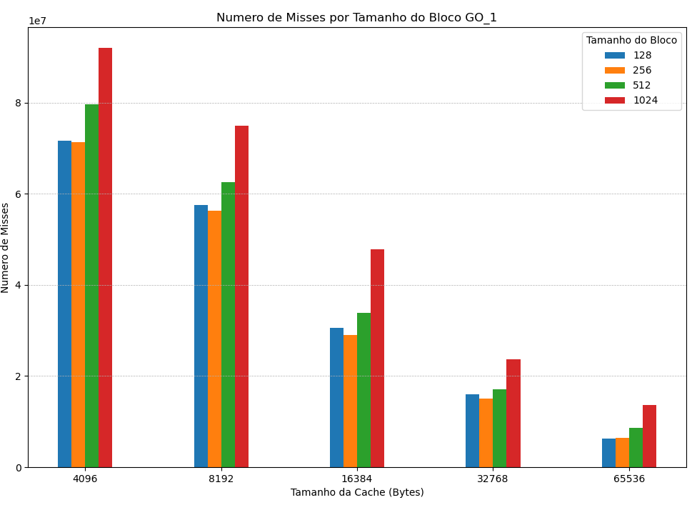
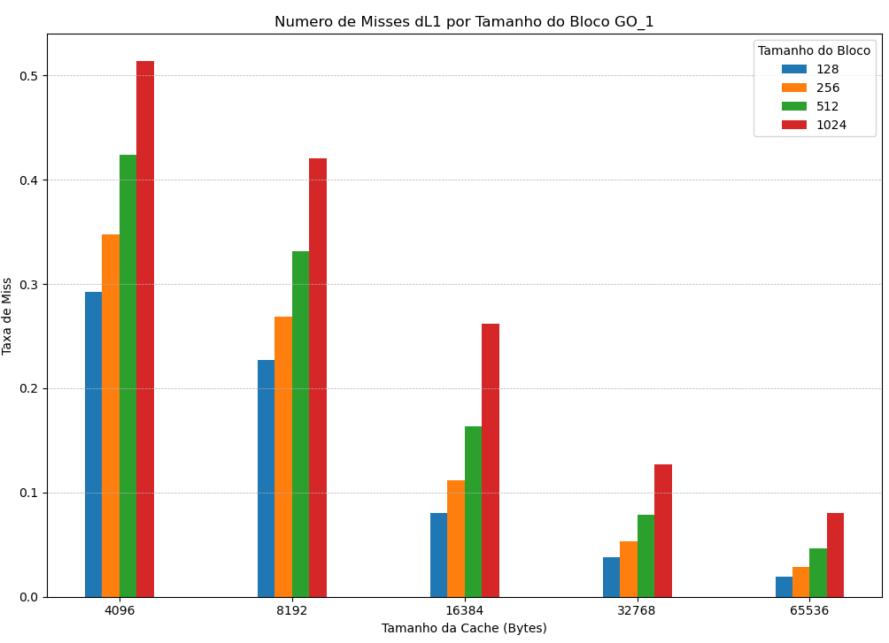
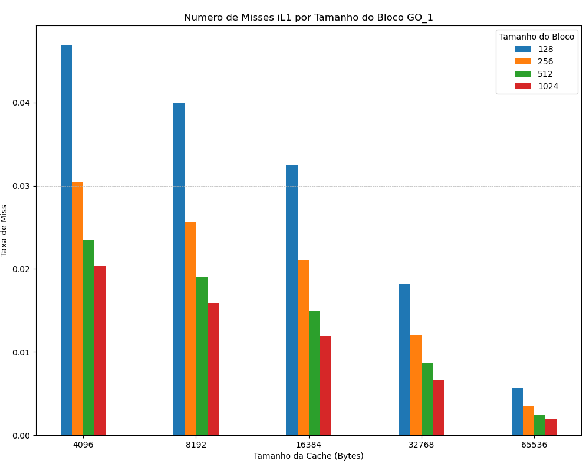

## Bonus Experiment
The bonus experiment show how the addition of an unified L2 cache compare with the addition of a split L2 cache

### GCC
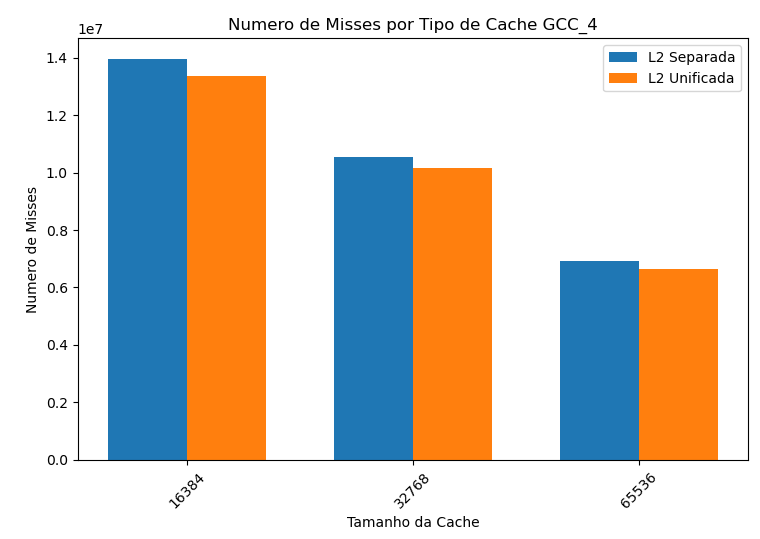
### GO
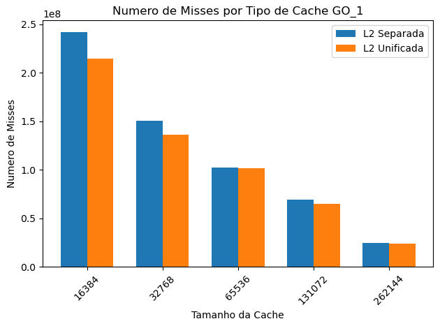
